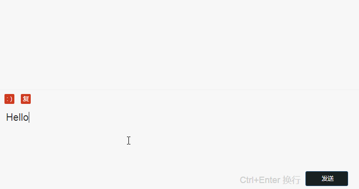

# 一个支持表情文字共存的输入框

#### 简单介绍

使用原生js实现的支持图片、文字共存的输入框，主要使用场景是聊天、发送弹幕等。

#### 主要有两个注意点

- 插入表情的时候，需要使用Range对象来插入，否则定位会始终在输入信息的最前方。
- 粘贴复制内容的时候需要过滤复制过来的标签信息等，同样使用Range插入。

#### 其余注意点

- 使用 enter 发送信息时，需要设置定时器，否则使用换行的 ctrl + enter 的时候，会识别到 enter 键直接发送。
- 由于 contenteditable 模拟的输入框是没有placeholder 的，所以设置了也没有用，所以需要用伪元素或者内容模拟。

#### 使用 Range 对象插入内容到指定位置的大致流程

1. 使用 getSelection 获取上次鼠标选中位置

2. 使用 getRangeAt(0) 获取到光标位置

3. 使用 createContextualFragment 创建一个包含将要插入内容的 documentFragement。

4. 获取步骤(3)代码片段的最后一个元素 .lastChild

5. 使用 extractContents 删除选中内容

6. 使用 insertNode 将刚刚创建的文档片段插入到指定位置

7. 使用 setStart setStartBefore setStartAfter setEnd setEndBefore setEndAfter 等方法将光标位置移到(步骤4)获取的文档片段后面。

   ​

#### Tips

- clipboardData 里面的方法参数只说了参数类型，支持的详细参数没有列出来查了好久才查出来
  - clipboardData.getData(in String type) 只支持 'Url' 和 ‘Text’ 类型
- 发现如果在文字后面插入   即回车的时候，换行会失败需要再按一次换行才可以。
  - 解决方法： 判断是回车的时候插入回车后先将输入框末尾的空'#Text'节点删除，在判断最后一个节点是不是本次添加的  ，是的话之后再插入一个空格，并把光标插入到添加的空格前面。
  - 注意： 发送的时候需要将换行标签替换成 \n ，然后用 String.trim() 方法来删除头尾多余缩进换行等。

[`Clipboard`](https://developer.mozilla.org/zh-CN/docs/Web/API/Clipboard) 方法其实还有很多拓展， 比如我们常常在 blog 上面看到一些东西想要复制， 粘贴的时候就会发现后面有 ‘请注明出处’ 等尾巴，也是用这个对象把内容写到粘贴板的。

#### 资料

[W3school Range 对象介绍](http://www.w3school.com.cn/xmldom/dom_range.asp)

[MDN paste事件介绍](https://developer.mozilla.org/zh-CN/docs/Web/Events/paste)